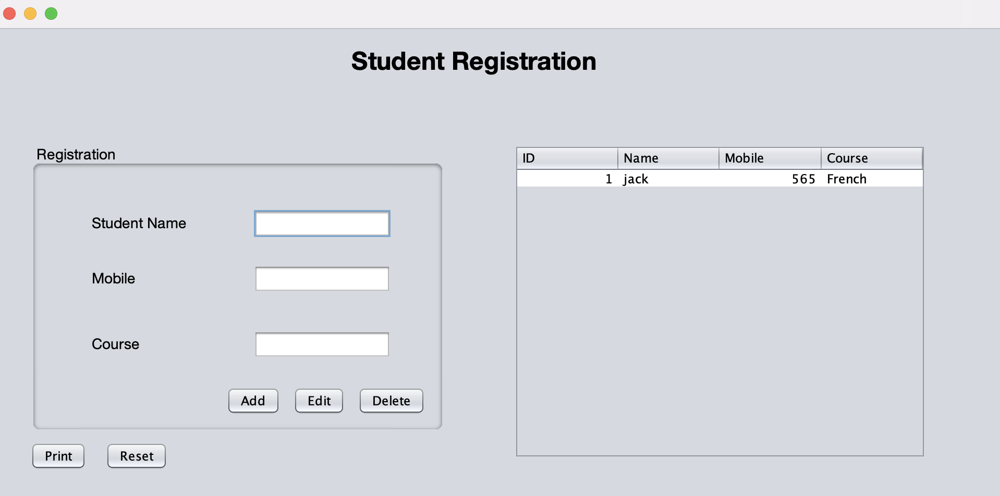

<!-- PROJECT LOGO -->
<br />
<p align="center">
  <a href="https://github.com/rom1trt/student-management-system">
    
  </a>

  <h3 align="center">Student Database Management System</h3>

  <p align="center">
    A student database management system using JFrame and SQL.
    <br />
    <a href="https://github.com/rom1trt/student-management-system"><strong>Explore the docs »</strong></a>
    <br />
    <br />
    <a href="https://github.com/rom1trt/student-management-system">View Demo</a>
    ·
    <a href="https://github.com/rom1trt/student-management-system/issues">Report Bug</a>
    ·
    <a href="https://github.com/rom1trt/student-management-system/issues">Request Feature</a>
  </p>
</p>

<!-- TABLE OF CONTENTS -->
<details open="open">
  <summary>Table of Contents</summary>
  <ol>
    <li>
      <a href="#about-the-project">About The Project</a>
      <ul>
        <li><a href="#built-with">Built With</a></li>
      </ul>
    </li>
    <li>
      <a href="#getting-started">Getting Started</a>
      <ul>
        <li><a href="#prerequisites">Prerequisites</a></li>
        <li><a href="#installation">Installation</a></li>
      </ul>
    </li>
  </ol>
</details>


<!-- ABOUT THE PROJECT -->
## About The Project

Schools and Universities are the foundation of knowledge and an educational body on which students rely upon. Therefore, they need to maintain a proper database of its students to keep all the updated records and easily share information with students.

### Built With

#### Java
#### SQL (MySQL)
#### Apache NetBeans


<!-- GETTING STARTED -->
## Getting Started

This is an example of how you may give instructions on setting up your project locally.
To get a local copy up and running follow these simple example steps.

### Prerequisites
To make the project run, you will need to download:
* [Apache NetBeans IDE](https://netbeans.apache.org/)
* [MysqL Community Server](https://dev.mysql.com/downloads/mysql/)
* [MySQL Docker image](https://hub.docker.com/_/mysql)


### Installation

1. Clone the repository 
```sh
git clone https://github.com/rom1trt/student-management-system.git
```
2. Open the project in Apache Netbeans
3. Create a new MySQL Connection in MySQLWorkBench with `hostname: 127.0.0.1`and `port: 3306`
4. Connect to the database
5. Run the MySQL docker image in parallel
6. Run the `main.java` file in Appache NetBeans
